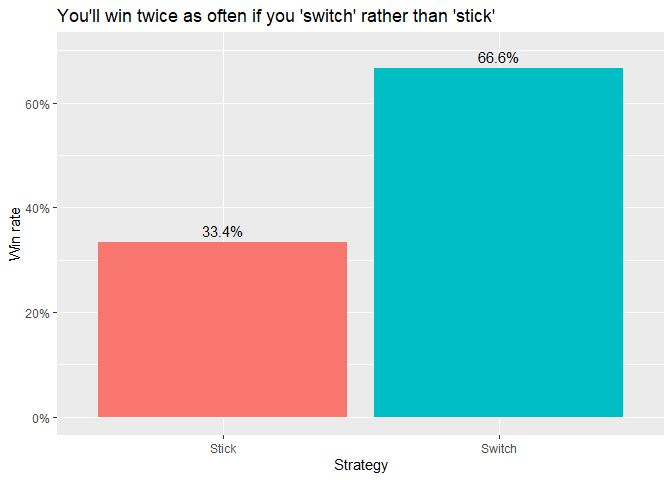

### Monty Hall simulation and explanation

You’re a contestant on a game show. The host (Monty Hall) presents three
closed doors to you. He says one of the doors conceals a prize (a car)
and the other two doors conceal nothing you want (a goat). Monty knows
which door the prize is hiding. Your job is to guess the correct door so
you can win a brand new car.

But, there’s a twist. After you make your guess, Monty opens a door you
did not select, revealing a goat. He asks you if you want to stick with
your original guess or switch to the other closed door. What strategy
will be best in the long run, sticking with your original guess, or
switching?

A few notes that aren’t always made clear in this explanation:

-   The host knows what is hiding behind all the doors
-   The host will always give you the option to ‘stick’ or ‘switch’
-   The host will only open a door that does not conceal the prize (it
    would make the game pointless if the host opened a door that was
    concealing the prize)
-   The host will also not open the door that you originally guessed

The code below runs a monte carlo simulation with one million
replications in R to demonstrate that the ‘switching’ strategy is the
superior strategy. In fact, you double your chances if you ‘switch’
rather than ‘stick’.

<br />

``` r
library(tidyverse)

#number of monty hall simulations
n_sims <- 1e6

#the three doors are represented by the ints 1, 2, 3 
doors <- 1:3

#this function simulates the host opening a door after the contestant has selected a door
# the function selects the door that does not conceal the prize, 
# or the door the contestant selected
host_opens_door <- function(prize_door, guess_door, doors){
    first(doors[! doors %in% c(prize_door, guess_door)])
}

#this function simulates the contestant switching from their original choice
# to the other closed doors
#this function selects the door that does not conceal the prize, 
# or the door the contestant selected
switch_picks <- function(guess_door, open_door, doors){
    first(doors[! doors %in% c(guess_door, open_door)])
}

#run monte carlo monty hall simulation
#sample a random door for the prize to be concealing
results <- tibble(prize_door = sample(doors, n_sims, replace = TRUE)) %>%
    #sample a random door for the contestants initial guess
    mutate(guess_door = sample(doors, n_sims, replace = TRUE)) %>%
    #have the host open the door that does not conceal the prize, or the door the contestant originally selected
    mutate(host_opens_door = map2_int(prize_door, guess_door, host_opens_door, doors = doors)) %>%
    #the stick strategy is the same as their original pick
    mutate(stick_pick = guess_door) %>%
    #whether the stick strategy won or lost
    mutate(stick_wins = stick_pick == prize_door) %>%
    #have the contestant use the stitch strategy and select the other closed door
    mutate(switch_pick = map2_int(guess_door, host_opens_door, switch_picks, doors = doors)) %>%
    #whether the switch strategy won or lost
    mutate(switch_wins = switch_pick == prize_door) %>%
    #proportion of wins for the stick and switch strategies
    summarize(stick_win_rate = mean(stick_wins),
              switch_win_rate = mean(switch_wins))

results %>%
    pivot_longer(everything(), names_to = "strategy", values_to = "win_rate") %>%
    mutate(strategy = fct_recode(strategy, Stick = "stick_win_rate", Switch = "switch_win_rate")) %>%
    ggplot(aes(strategy, win_rate, fill = strategy, label = glue::glue("{(win_rate * 100) %>% round(2)}%"))) +
    geom_col() +
    geom_text(vjust = -0.5) +
    labs(x = "Strategy",
         y = "Win rate",
         title = "You'll win twice as often if you 'switch' rather than 'stick'") +
    scale_y_continuous(labels = scales::percent_format()) +
    theme(legend.position = "none") +
    expand_limits(y = 0.7)
```



<br />

### Explanation

The simulation is a nice way to see the switching strategy is the better
bet. The table below shows the nine possible combinations for which door
the prize is concealed behind (i.e., door 1, 2, or 3) and the
contestant’s guess of door 1, 2, or 3. We can esily verify the sticking
strategy only leads to a win rate of 3/9 = 1/3 = 33.33%, whereas the
switching strategy leads to a win rate of 6/9 = 2/3 = 66.66%. These
numbers are very close to those reported in the simulation.

<table class="table" style="margin-left: auto; margin-right: auto;">
<thead>
<tr>
<th style="text-align:right;">
Prize door
</th>
<th style="text-align:right;">
Your guess
</th>
<th style="text-align:left;">
Door the host opens
</th>
<th style="text-align:left;">
Stick strategy selection
</th>
<th style="text-align:left;">
Switch strategy selection
</th>
</tr>
</thead>
<tbody>
<tr>
<td style="text-align:right;border-left:1px solid;border-right:1px solid;">
1
</td>
<td style="text-align:right;border-left:1px solid;border-right:1px solid;">
1
</td>
<td style="text-align:left;border-left:1px solid;border-right:1px solid;">
2 or 3
</td>
<td style="text-align:left;border-left:1px solid;border-right:1px solid;">
1 (you win)
</td>
<td style="text-align:left;border-left:1px solid;border-right:1px solid;">
2 or 3 (you lose)
</td>
</tr>
<tr>
<td style="text-align:right;border-left:1px solid;border-right:1px solid;">
1
</td>
<td style="text-align:right;border-left:1px solid;border-right:1px solid;">
2
</td>
<td style="text-align:left;border-left:1px solid;border-right:1px solid;">
3
</td>
<td style="text-align:left;border-left:1px solid;border-right:1px solid;">
2 (you lose)
</td>
<td style="text-align:left;border-left:1px solid;border-right:1px solid;">
1 (you win)
</td>
</tr>
<tr>
<td style="text-align:right;border-left:1px solid;border-right:1px solid;">
1
</td>
<td style="text-align:right;border-left:1px solid;border-right:1px solid;">
3
</td>
<td style="text-align:left;border-left:1px solid;border-right:1px solid;">
2
</td>
<td style="text-align:left;border-left:1px solid;border-right:1px solid;">
3 (you lose)
</td>
<td style="text-align:left;border-left:1px solid;border-right:1px solid;">
1 (you win)
</td>
</tr>
<tr>
<td style="text-align:right;border-left:1px solid;border-right:1px solid;">
2
</td>
<td style="text-align:right;border-left:1px solid;border-right:1px solid;">
1
</td>
<td style="text-align:left;border-left:1px solid;border-right:1px solid;">
3
</td>
<td style="text-align:left;border-left:1px solid;border-right:1px solid;">
1 (you lose)
</td>
<td style="text-align:left;border-left:1px solid;border-right:1px solid;">
2 (you win)
</td>
</tr>
<tr>
<td style="text-align:right;border-left:1px solid;border-right:1px solid;">
2
</td>
<td style="text-align:right;border-left:1px solid;border-right:1px solid;">
2
</td>
<td style="text-align:left;border-left:1px solid;border-right:1px solid;">
1 or 3
</td>
<td style="text-align:left;border-left:1px solid;border-right:1px solid;">
2 (you win)
</td>
<td style="text-align:left;border-left:1px solid;border-right:1px solid;">
1 or 3 (you lose)
</td>
</tr>
<tr>
<td style="text-align:right;border-left:1px solid;border-right:1px solid;">
2
</td>
<td style="text-align:right;border-left:1px solid;border-right:1px solid;">
3
</td>
<td style="text-align:left;border-left:1px solid;border-right:1px solid;">
1
</td>
<td style="text-align:left;border-left:1px solid;border-right:1px solid;">
3 (you lose)
</td>
<td style="text-align:left;border-left:1px solid;border-right:1px solid;">
2 (you win)
</td>
</tr>
<tr>
<td style="text-align:right;border-left:1px solid;border-right:1px solid;">
3
</td>
<td style="text-align:right;border-left:1px solid;border-right:1px solid;">
1
</td>
<td style="text-align:left;border-left:1px solid;border-right:1px solid;">
2
</td>
<td style="text-align:left;border-left:1px solid;border-right:1px solid;">
1 (you lose)
</td>
<td style="text-align:left;border-left:1px solid;border-right:1px solid;">
3 (you win)
</td>
</tr>
<tr>
<td style="text-align:right;border-left:1px solid;border-right:1px solid;">
3
</td>
<td style="text-align:right;border-left:1px solid;border-right:1px solid;">
2
</td>
<td style="text-align:left;border-left:1px solid;border-right:1px solid;">
1
</td>
<td style="text-align:left;border-left:1px solid;border-right:1px solid;">
2 (you lose)
</td>
<td style="text-align:left;border-left:1px solid;border-right:1px solid;">
3 (you win)
</td>
</tr>
<tr>
<td style="text-align:right;border-left:1px solid;border-right:1px solid;">
3
</td>
<td style="text-align:right;border-left:1px solid;border-right:1px solid;">
3
</td>
<td style="text-align:left;border-left:1px solid;border-right:1px solid;">
1 or 2
</td>
<td style="text-align:left;border-left:1px solid;border-right:1px solid;">
3 (you win)
</td>
<td style="text-align:left;border-left:1px solid;border-right:1px solid;">
1 or 2 (you lose)
</td>
</tr>
</tbody>
</table>

<br /> <br /> <br /> <br /> <br />
